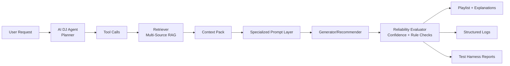

# Applied AI Music Recommender: Final Project Plan

## Project Goal
- [ ] Deliver a production-style Applied AI system that exceeds baseline requirements by implementing:
- [ ] Feature 1: RAG + RAG Enhancement (stretch)
- [ ] Feature 2: Agentic Workflow + Enhancement (stretch)
- [ ] Feature 3: Specialization + Enhancement (stretch)
- [ ] Feature 4: Reliability System + Test Harness (stretch)
- [ ] Strong architecture artifacts, complete docs, and final Loom demo

## Success Targets (100%+)
- [ ] All required features implemented and demonstrated end-to-end
- [ ] All stretch goals implemented with measurable evidence
- [ ] Automated test harness produces pass/fail summary and confidence metrics
- [ ] README and model card complete and reviewer-ready
- [ ] 5-7 minute Loom includes 2-3 complete runs (without setup walkthrough)

---

## Phase 0: Rapid Setup and Baseline Lock
- [ ] Create project branch for final feature work
- [ ] Run existing tests and baseline simulation to capture current behavior
- [ ] Freeze baseline outputs for comparison (save sample prompts + outputs)
- [ ] Add folder structure for new system components:
- [ ] `src/retrieval/`
- [ ] `src/agent/`
- [ ] `src/specialization/`
- [ ] `src/reliability/`
- [ ] `src/evaluation/`
- [ ] `scripts/` (test harness + utility scripts)
- [ ] `assets/` (diagram PNG and presentation artifacts)
- [ ] Add config file for model/provider settings and feature flags
- [ ] Define logging format and output location (`logs/` or structured console JSON)

Acceptance criteria
- [ ] Baseline behavior is reproducible
- [ ] New folders and config conventions are in place
- [ ] Team can run one command to launch the app in baseline mode

---

## Feature 1: RAG System (Required)

### 1.1 Retriever Core
- [ ] Define retrieval schema for music context chunks:
- [ ] artist bio summary
- [ ] genre/style tags
- [ ] mood/energy descriptors
- [ ] track-level metadata (tempo, era, instrumentation)
- [ ] source attribution fields (source name, URL/file, timestamp)
- [ ] Implement ingestion pipeline for text sources and CSV metadata
- [ ] Normalize text (lowercase, punctuation cleanup, deduplication)
- [ ] Chunk context into retrievable units with stable IDs
- [ ] Build embeddings index (FAISS/Chroma or equivalent Python-compatible index)
- [ ] Implement top-k retrieval API with similarity scores
- [ ] Add citations in recommendation explanations

### 1.2 RAG Integration in Recommender
- [ ] Update recommendation flow to retrieve context before generation
- [ ] Pass retrieved context into model prompt template
- [ ] Ensure output includes rationale linked to retrieved evidence
- [ ] Add fallback behavior when retrieval returns low-quality/no results

Acceptance criteria (required)
- [ ] At least one recommendation run shows clear context-grounded explanation
- [ ] Output cites which source/context chunk influenced recommendation
- [ ] Non-RAG baseline vs RAG comparison is documented

### 1.3 RAG Enhancement (Stretch): Multi-Source Retrieval
- [ ] Add at least 2-3 custom data sources beyond starter dataset (examples: curated genre notes, artist interviews, playlist editorial notes, local markdown docs)
- [ ] Tag source type and trust level for each chunk
- [ ] Implement retrieval fusion or reranking across sources
- [ ] Add evaluation script to compare explanation quality with:
- [ ] single-source RAG
- [ ] multi-source enhanced RAG
- [ ] Track measurable improvements:
- [ ] relevance score
- [ ] citation diversity
- [ ] explanation completeness

Stretch acceptance criteria
- [ ] Multi-source mode outperforms baseline on at least one predefined metric
- [ ] Evidence of improvement included in README testing summary

---

## Feature 2: Agentic Workflow (Required)

### 2.1 AI DJ Agent Architecture
- [ ] Define agent objective: produce coherent playlist tailored to user intent
- [ ] Implement planner-executor-evaluator loop:
- [ ] Planner: creates playlist strategy (theme, tempo curve, diversity goals)
- [ ] Executor: calls retrieval and recommendation tools per step
- [ ] Evaluator: checks playlist coherence and revises if needed
- [ ] Define tool interface functions (Python):
- [ ] `fetch_candidate_tracks(query, constraints)`
- [ ] `get_genre_profile(track_or_artist)`
- [ ] `estimate_energy_score(track)`
- [ ] `validate_transition(prev_track, next_track)`
- [ ] Add max-iteration and timeout protections to prevent runaway loops

### 2.2 Agent Output
- [ ] Return playlist + step-by-step brief reasoning summary
- [ ] Include why each track was chosen and placement logic
- [ ] Include confidence and any caveats

Acceptance criteria (required)
- [ ] Agent can generate playlist in multi-step fashion, not single-shot only
- [ ] Agent can self-evaluate and revise at least once when constraints fail

### 2.3 Agentic Enhancement (Stretch): Observable Multi-Step Reasoning
- [ ] Add structured trace log for each tool call:
- [ ] step number
- [ ] selected tool
- [ ] tool input summary
- [ ] key result
- [ ] decision rationale
- [ ] Implement explicit energy flow checker across playlist sequence
- [ ] Add genre-balance checker to avoid over-concentration
- [ ] Expose trace in CLI/UI and save to JSON artifact for review

Stretch acceptance criteria
- [ ] Demo shows concrete tool calls and intermediate decisions
- [ ] Reviewer can follow planning -> action -> evaluation chain

---

## Feature 3: Specialization System (Required)

### 3.1 Specialized Persona/Mode
- [ ] Define specialization objective (example: Festival DJ, Chill Curator, or Vinyl Historian)
- [ ] Create specialized system prompt with strict output schema
- [ ] Add domain constraints:
- [ ] vocabulary style
- [ ] recommendation priorities
- [ ] era/genre rules
- [ ] Add prompt template versioning for A/B testing

### 3.2 Compare Specialized vs Standard
- [ ] Implement switch between default mode and specialized mode
- [ ] Build comparison script for same input prompt across modes
- [ ] Measure differences:
- [ ] persona consistency
- [ ] recommendation uniqueness
- [ ] adherence to user constraints

Acceptance criteria (required)
- [ ] Specialized mode is clearly different and consistently applied

### 3.3 Specialization Enhancement (Stretch): Few-Shot or Constrained Prompting
- [ ] Add few-shot examples representing desired specialist behavior
- [ ] Use explicit rules/checklist in system prompt (hard constraints)
- [ ] Add evaluator that flags persona drift or schema violations
- [ ] Quantify improvement over unconstrained prompt mode

Stretch acceptance criteria
- [ ] Measurable improvement documented (e.g., higher schema compliance, stronger persona consistency)

---

## Feature 4: Reliability System (Required)

### 4.1 Reliability Foundation
- [ ] Add structured error handling for:
- [ ] retrieval/index failures
- [ ] model API/network errors
- [ ] invalid user input
- [ ] empty recommendation sets
- [ ] Implement centralized logging with severity levels (INFO/WARN/ERROR)
- [ ] Add confidence scoring strategy:
- [ ] retrieval confidence (similarity strength)
- [ ] rule compliance confidence (constraints satisfied)
- [ ] generation confidence (heuristic or model-provided if available)
- [ ] Define low-confidence fallback response behavior

### 4.2 Reliability Observability
- [ ] Include confidence and warning annotations in final output
- [ ] Add per-run diagnostics object saved as JSON
- [ ] Create reliability dashboard summary in console after each run

Acceptance criteria (required)
- [ ] System degrades gracefully without crashing on common failure paths
- [ ] Confidence score appears in user-visible output

### 4.3 Reliability Stretch: Automated Test Harness
- [ ] Create `scripts/test_harness.py` to run predefined scenarios automatically
- [ ] Define scenario matrix:
- [ ] normal requests
- [ ] edge cases
- [ ] contradictory constraints
- [ ] missing/poor retrieval context
- [ ] API error simulation
- [ ] For each scenario, record:
- [ ] pass/fail
- [ ] latency
- [ ] confidence score
- [ ] key quality checks (format, grounding, coherence)
- [ ] Generate machine-readable and human-readable summary reports:
- [ ] `outputs/test_harness_results.json`
- [ ] `outputs/test_harness_summary.md`

Stretch acceptance criteria
- [ ] Harness executes with one command and produces score summary
- [ ] Summary included in README testing section

---

## Architecture and Assets

### 5.1 System Diagram (Mermaid)
- [ ] Draft Mermaid architecture diagram with these components:
- [ ] User Input
- [ ] Retriever (multi-source index)
- [ ] AI DJ Agent (planner/executor)
- [ ] Specialized Prompt Layer
- [ ] Reliability/Evaluator Layer
- [ ] Final Output + Logs + Test Harness Reports
- [ ] Save diagram source in docs or README section

Suggested Mermaid starter
- [ ] Include and customize:

### 5.2 Export Assets
- [ ] Export Mermaid diagram to PNG
- [ ] Save in `assets/system-architecture.png`
- [ ] Reference PNG in README

Acceptance criteria
- [ ] Diagram is present in both source form (Mermaid) and PNG asset
- [ ] Diagram accurately reflects implemented data flow

---

## Documentation Plan

### 6.1 README.md Checklist
- [ ] Project summary and problem statement
- [ ] Architecture overview with system diagram image
- [ ] Setup instructions (dependencies, environment variables, run commands)
- [ ] Usage instructions for normal run and test harness run
- [ ] 2-3 sample interactions with input and output snippets
- [ ] Design decisions:
- [ ] why chosen retrieval approach
- [ ] why agent structure and tool interfaces
- [ ] why specialization strategy
- [ ] Testing summary:
- [ ] reliability outcomes
- [ ] harness score snapshot
- [ ] stretch-goal impact metrics

### 6.2 model_card.md Checklist
- [ ] Intended use and out-of-scope use
- [ ] Limitations and bias discussion
- [ ] Misuse prevention and safety notes
- [ ] Evaluation approach and key metrics
- [ ] Testing surprises or failure cases discovered
- [ ] AI collaboration reflection:
- [ ] one helpful AI suggestion and impact
- [ ] one flawed AI suggestion and correction made

Acceptance criteria
- [ ] README can onboard a new reviewer in under 10 minutes
- [ ] Model card honestly documents risks, tradeoffs, and lessons learned

---

## Final Presentation (Loom) Checklist
- [ ] Record 5-7 minute Loom video
- [ ] Demo 2-3 end-to-end runs with different user intents
- [ ] Show RAG context usage and citation evidence
- [ ] Show AI DJ agent multi-step behavior and at least one revision
- [ ] Show specialization mode output vs standard output
- [ ] Show reliability checks: confidence score + graceful error/fallback
- [ ] Show automated test harness summary report
- [ ] Avoid spending video time on code setup/install
- [ ] End with key takeaways: what worked, what improved via stretch goals

Acceptance criteria
- [ ] Video clearly proves required features and stretch enhancements in action

---

## Suggested Execution Order (Fastest Path)
- [ ] Step 1: Lock baseline and scaffolding
- [ ] Step 2: Implement core RAG (single source)
- [ ] Step 3: Build AI DJ planner-executor-evaluator loop
- [ ] Step 4: Add specialization prompt layer + mode switch
- [ ] Step 5: Add reliability (error handling/logging/confidence)
- [ ] Step 6: Add stretch enhancements (multi-source RAG, traceable tool calls, few-shot constraints)
- [ ] Step 7: Build and run automated test harness
- [ ] Step 8: Finalize diagram + PNG asset
- [ ] Step 9: Complete README/model card
- [ ] Step 10: Record Loom demo

---

## Definition of Done (Project Complete)
- [ ] All 4 required features are implemented and demonstrated
- [ ] All 4 stretch enhancements are implemented with measurable evidence
- [ ] Architecture diagram exists and PNG is exported in `assets/`
- [ ] README and model_card are complete and internally consistent
- [ ] Test harness report is generated and included in documentation
- [ ] Loom demo is recorded and showcases full AI workflow
